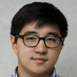
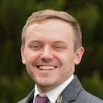

# OSGVSP20 – Staff

<table>
  <tbody>
    <tr>
      <td width="150px"></td>
      <td>
        
Tim Cartwright

        

          Tim founded the OSG School in 2010 and has led it since.
          When not involved in training, he mostly works for OSG in management,
          where he helps the project as a whole in a variety of capacities.
          Tim started working with OSG in 2005, originally focusing on software integration.
        

      </td>
    </tr>
    <tr>
      <td width="150px"></td>
      <td>
        
Lauren Michael

        

          Lauren serves as co-Director of the OSG School program.
          She leads Research Computing Facilitation teams for the OSG and at UW-Madison,
          where she has worked since 2013,
          and leverages research background in Biophysics and Life Sciences Communication.
        

      </td>
    </tr>
    <tr>
      <td width="150px"></td>
      <td>
        
Brian Lin

        

          Brian is the OSG Software Team manager
          and is responsible for maintaining the software catalog used by OSG resource providers.
          He has worked for the CHTC at the University of Wisconsin&ndash;Madison since 2013.
        

      </td>
    </tr>
    <tr>
      <td width="150px"></td>
      <td>
        
Christina Koch

        

          Christina is a Research Computing Facilitator at the University of Wisconsin&ndash;Madison,
          where she helps researchers transition their big computational problems to large-scale computing resources.
          She facilitates use of both local resources at UW&ndash;Madison and access to the national Open Science Grid. 
        

      </td>
    </tr>
    <tr>
      <td width="150px"></td>
      <td>
        
Derek Weitzel

        

          Derek is a research assistant professor at the University of Nebraska&ndash;Lincoln.
          He is a member of the OSG Technology and Operations teams
          and has worked with the OSG since graduate school in 2009.
          (Note: Derek is unavailable during Week 2.)
        

      </td>
    </tr>
    <tr>
      <td width="150px"></td>
      <td>
        
Emelie Fuchs

        

          Emelie is an HPC Applications Specialist and OSG Research Facilitator
          at the University of Nebraska&ndash;Lincoln Holland Computing Center.
        

      </td>
    </tr>
    <tr>
      <td width="150px"></td>
      <td>
        
Ian Ross

        

          Ian works as a developer in the Center for High Throughput Computing,
          coupling high-throughput workflows with systems to enable text data-mining
          across millions of scientific documents.
          He has worked in the group since 2014, after completing his Ph.D. in high energy particle physics.
        

      </td>
    </tr>
    <tr>
      <td width="150px"></td>
      <td>
        
Jason Patton

        

          Jason is a Software Integration Scientist for the CHTC.
          He assists researchers and system administrators to get their applications working with the HTCondor software.
          He has worked for the CHTC at the University of Wisconsin&ndash;Madison since 2016.
        

      </td>
    </tr>
    <tr>
      <td width="150px"></td>
      <td>
        
Jess Vera

        

          Jess is a Research Computing Facilitator for the OSG and at the University of Wisconsin&ndash;Madison,
          where she has worked since 2019 and has extensive research experience in
          bioinformatics, genomics, and transcriptomics.
        

      </td>
    </tr>
    <tr>
      <td width="150px"></td>
      <td>
        
Josh Karpel

        

          Josh is a Postdoctoral Researcher at the Morgridge Institute for Research,
          focusing on high-throughput computing techniques.
          Josh is experienced with running Python and Docker-based programs on HTCondor pools,
          and his background is in computational quantum mechanics.
        

      </td>
    </tr>
  </tbody>
</table>
